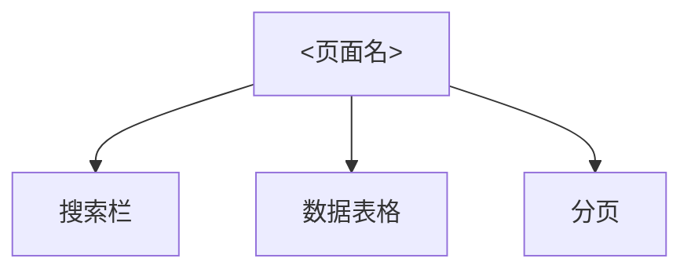

## User Input

```text
$ARGUMENTS
```

## Outline

### 0. 解析输出目录并应用已批准的进化提案（前置）

```
output = --output 显式值，否则为 ./output/<source项目名>
codebook_root = <output>/.codebook/

for each file in <codebook_root>proposals/run-pipeline-*.md:
  if file contains "status: approved":
    读取"建议修复"部分，按建议修改本 skill.md
    将 status 改为 "applied"
    记录到 <codebook_root>skill-evolution.log
```

若 `<codebook_root>proposals/` 不存在，跳过提案应用。项目根目录现有 `.codebook/` 仅作为旧数据保留；新运行不读取、不覆盖、不迁移、不删除。

### 1. 解析参数

- `--source`（必填）：源代码目录绝对路径，作为 `-p` 或位置参数传给所有 Codegraph CLI 命令
- `--output`（可选，默认 `./output/<项目名>`）：产物输出目录；解析后固定设置 `codebook_root = <output>/.codebook/`
- `--module`（可选，可多次指定）：显式顶级模组入口，如 `apps/admin`、`backend/service-a`
- `--package <包名>`（可选，可多次指定）：显式后端包入口，如 `com.example.order`
- `--backend-business <业务名>`（可选，可多次指定）：显式后端业务切片，如 `emp`；匹配独立 package/namespace 段，横向收集 `controller.emp`、`service.emp`、`dao.emp`、`api.dto.emp` 等分层包
- `--frontend-view <视图路径>`（可选，可多次指定）：显式前端视图入口，如 `src/views/emp`；默认业务 key 为路径最后一级目录
- `--business-key <业务名>`（可选）：显式设置本次关联扩展使用的业务 key；未指定时从 `--backend-business` 值、`--frontend-view` 最后一级目录、`--package` 最后一级包段或 `--module` 最后一级目录推导
- `--expand-related`（可选）：在第 5 步基础入口文件枚举后，执行一层受控关联文件扩展；默认不扩展
- `--init-only`（可选）：只初始化或校验 `<codebook_root>`，不进入采集和文档生成
- `--refresh-entries`（可选）：重新识别顶级入口，只覆盖 `<codebook_root>entries.json`
- `--doc-quality-threshold`（可选，默认 `0.8`）：文档质量门禁阈值

如未提供 `--source`，向用户提问。所有日志输出使用中文，例如：

```
正在初始化本次输出目录下的 Codebook 配置：<codebook_root>
```

### 2. Codegraph CLI 与索引确认

> **执行方式**：本 skill 通过 **Bash 工具**直接调用 `codegraph` 可执行文件，禁止调用任何 `codegraph_*` MCP 工具，也不依赖 Codegraph MCP 服务器。
>
> 本文档中 `exec_json(args)` 的含义：使用 **Bash 工具**执行 `args` 数组拼接的命令（数组元素以空格分隔），解析并返回标准输出的 JSON。例如：
>
> ```
> exec_json(["codegraph", "status", "-j", "/path/to/source"])
> # 等价于 Bash: codegraph status -j /path/to/source
> ```

若 `<codebook_root>codegraph-tools.json` 已存在则读取它，否则先以内存方式读取 `resources/codebook/defaults/codegraph-tools.json`；第 3 步再完成输出目录初始化。读取其中的 `transport` 和 `commands`，固定设置：

```
codegraph_transport = "cli"
binary = tool_policy.transport.binary
```

所有命令模板都必须渲染为参数数组后直接执行，禁止拼接 shell 字符串。执行每条命令时，将参数数组、退出码和耗时写入后续 `quality.json.executed_commands`；标准输出只写入对应证据文件，不写入 `executed_commands`。

CLI 输出归一化只允许一个例外：`files -j` 没有匹配文件时，Codegraph 会输出信息文本而不是 JSON；当输出明确表示“无匹配文件”且退出码为 0 时，按 `output_normalization.files_no_match` 转换为空数组 `[]`。其他非法 JSON 一律按错误处理。

先执行：

```
version_args = render(tool_policy.commands.version, binary)
codegraph --version
```

若命令不存在、退出码非零、版本低于 `transport.minimum_version`，停止流程。将版本号写入 `quality.json.codegraph_cli_version`。

再执行：

```
status_args = render(tool_policy.commands.status, binary, source)
status = exec_json(status_args)
```

若索引不可用、命令退出码非零或标准输出不是合法 JSON，停止并提示用户先在源码目录运行 `codegraph init -i`。若索引可用，将 `status` 原样写入后续 `quality.json.index`。

从 `status.nodeCount` 中读取索引全部节点数并保存为 `index_total_nodes`。`index_total_nodes` 必须是正整数，后续第 6 步将它作为逐文件查询上限，确保单文件查询不会被固定小上限截断；无法取得全部节点数时停止流程，不得使用猜测值继续。

### 3. 初始化或读取 `<codebook_root>`

默认资产来源：`resources/codebook/defaults/`。

首次运行时复制以下文件到 `<codebook_root>`，已存在文件一律保留，不覆盖人工配置：

```text
<codebook_root>
├── manifest.json
├── entries.json
├── codegraph-tools.json
├── semantic-kinds.json
├── prompts/
│   ├── temp_typecard.json
│   ├── temp_architecture.json
│   ├── temp_business_flows.json
│   ├── temp_data_model.json
│   ├── temp_srs.json
│   └── temp_ui.json
├── evidence/
├── checkpoints/
├── proposals/
└── skill-evolution.log
```

初始化规则：

```
if <codebook_root> 不存在:
  从 resources/codebook/defaults/ 创建完整配置
  创建 evidence/、checkpoints/、proposals/ 目录
else:
  读取已有配置，不覆盖

if --refresh-entries:
  只重新生成 entries.json

if --init-only:
  校验 JSON 可读、transport.mode == "cli"、commands 包含 version/status/files/query/callers/callees
  校验 output_normalization.files_no_match == "empty_array"
  校验 entries.json.discovery.related_expansion.default_enabled == false
  校验 entries.json.discovery.related_expansion.max_depth == 1
  校验 prompt 模板包含 name/version/input_refs/prompt/output_schema
  输出中文校验报告后停止
```

### 4. 发现顶级入口

入口发现优先级固定为：

1. 显式参数：`--module`、`--package <包名>`、`--backend-business <业务名>` 和 `--frontend-view <视图路径>`
2. 多模组项目：含 `pom.xml`、`build.gradle`、`package.json`、`pyproject.toml`、`go.mod` 等标记的源码目录
3. 无模组后端：公共根包 + 下一层包
4. 前端工程：`--module` 优先，没有 `--module` 则为 `<source>` 源码根目录
5. 无法识别时：项目根目录兜底

发现过程必须先用 Codegraph CLI `files -j` 枚举文件，不能用 `query` 做清点。

```
tool_policy = read <codebook_root>codegraph-tools.json
entries_config = read <codebook_root>entries.json

tree_args = [
  binary, "files", "-p", source, "--format", "tree",
  "--max-depth", tool_policy.tools.codegraph_files.maxDepth, "-j"
]
tree = exec_json(tree_args)
```

后端包入口规则：

```
从 .java/.kt/.cs 等源码文件中识别 package/namespace
求公共根包
按"公共根包 + 下一层包"分组
示例：com.example.order.service 和 com.example.order.controller → com.example.order
```

显式后端业务切片规则：

```
for each --backend-business value as business_key:
  business_key 必须是非空单段标识，不得包含 /、\ 或 ..
  使用 Codegraph CLI files -j 枚举 .java/.kt/.cs 等源码文件
  解析 package/namespace 声明并按 . 分段
  若任一 package/namespace 段与 business_key 完全相等，则纳入 matched_packages 与 matched_paths
  不得用子串匹配；emp 不匹配 employee、temp 或 employment
  生成 entry_type = "backend_business_slice"
  entry.id = "backend-business-" + business_key
  entry.business_key = business_key
  entry.matched_packages = 去重后的完整包名
  entry.matched_paths = 去重后的源码目录路径
```

前端入口规则：

```
若 --frontend-view 指定了路径：
  校验路径仍位于 <source> 内，不允许绝对路径逃逸、.. 逃逸或空路径
  以 --frontend-view 值生成 frontend_view 入口
  business_key = --business-key 显式值，否则为视图路径最后一级目录
若 --module 指定了路径：
  以 --module 值生成 frontend_root 入口
否则：
  以 <source> 生成 frontend_root 入口
```

写入 `<codebook_root>entries.json` 时，每个入口必须符合 EntryDefinition：

```json
{
  "id": "backend-package-com-example-order",
  "entry_type": "backend_package",
  "path": "src/main/java/com/example/order",
  "package_prefix": "com.example.order",
  "business_key": "order",
  "matched_paths": ["src/main/java/com/example/order"],
  "related_expansion": {
    "enabled": false,
    "max_depth": 1,
    "business_key": "order"
  },
  "languages": ["java"],
  "include_patterns": ["**/*.java"],
  "exclude_patterns": ["**/*Test.java", "**/test/**", "**/fixtures/**"],
  "enabled": true
}
```

### 5. 逐入口枚举文件

对 `<codebook_root>entries.json.entries` 中 `enabled=true` 的入口逐个处理：

```
for each entry:
  files = []
  entry_paths = entry.matched_paths 非空时使用 entry.matched_paths，否则使用 [entry.path]
  for each entry_path in entry_paths:
    for each pattern in entry.include_patterns:
      files_args = render(
        tool_policy.commands.files,
        binary,
        source,
        entry_path,
        pattern
      )
      files += exec_json(files_args)

  source_files = 排除 entry.exclude_patterns、测试、mock、fixture、dist、build、target、node_modules
  base_files = 按 path 去重后的 source_files
  写入 <codebook_root>evidence/<entry-id>/inventory.json 的 base_files
```

`files` 无匹配时按配置归一化为空数组。其他 `files` 命令退出码非零或返回非法 JSON 时，将错误写入 `quality.json.query_failures`，按 `transport.error_policy` 阻断当前入口。

若入口没有源码文件：

```
记录 entry_coverage[entry.id].skipped = "无源码证据"
跳过该入口后续采集
```

#### 5.1 受控关联文件扩展（可选）

默认不做关联扩展。只有当用户传入 `--expand-related`，或入口配置中 `entry.related_expansion.enabled == true` 时，才在基础 `inventory.json` 上追加一层关联文件。扩展必须先完成基础入口文件枚举；不得跳过基础入口直接全库搜索。

业务 key 解析顺序固定为：

1. `--business-key` 显式值
2. `entry.related_expansion.business_key`
3. `entry.business_key`
4. `--backend-business` 的业务名
5. `--frontend-view` 路径最后一级目录
6. `--package` 最后一级包段
7. `--module` 最后一级目录

无法解析出业务 key 时，跳过关联扩展并在 `quality.json.related_expansion[entry.id].skipped_reason` 记录 `"缺少业务 key"`。业务 key 必须作为完整路径段或完整 package/namespace 段匹配；禁止子串匹配，例如 `emp` 不匹配 `employee`、`temp` 或 `employment`。

关联候选来源固定为一层：

```
for each base_file in inventory.files:
  base_symbols = 第 6 步同款 path:<base_file.path> 查询并按 node.filePath 精确过滤
  for each analysable symbol in base_symbols:
    callers = codegraph callers -p <source> -l <limit> -j <symbol.node.name>
    callees = codegraph callees -p <source> -l <limit> -j <symbol.node.name>
    related_candidates += callers 与 callees 中的 node.filePath

  import/reference candidates:
    从 base_file 源码中解析静态 import、export from、require、Java import、Kotlin import、C# using
    仅解析可映射到源码文件的相对路径或同源 package 路径
    无法确定到具体文件时，只记录为 external_reference，不纳入 inventory
```

候选文件只有同时满足以下条件才可加入当前入口：

- `candidate_path` 解析后仍位于 `<source>` 内
- 不命中测试、mock、fixture、dist、build、target、node_modules 等排除规则
- 文件扩展名符合当前入口语言或 `include_patterns`
- 文件路径段或 package/namespace 段命中业务 key
- 关联深度为 1；新增文件不得继续递归扩展

前端示例：

```text
基础入口：src/views/emp
可加入：src/api/emp.ts、src/store/modules/emp.ts、src/types/emp.ts
只作为外部依赖引用：src/utils/request.ts（无 emp 路径段或 package 段）
不加入：src/views/dept/index.vue、src/api/dept.ts
```

后端示例：

```text
基础入口：com.xx.controller.emp
可加入：com.xx.service.emp、com.xx.dao.emp、com.xx.api.dto.emp
不加入：com.xx.employee、com.xx.temp、无 emp 段的基础设施包
```

扩展完成后重写当前入口的 `inventory.json`，字段必须包含：

```json
{
  "entry_id": "<entry-id>",
  "business_key": "emp",
  "related_expansion": {
    "enabled": true,
    "max_depth": 1,
    "base_file_count": 0,
    "added_file_count": 0,
    "added_files": [],
    "external_references": [],
    "rejected_candidates": [
      {
        "path": "src/utils/request.ts",
        "reason": "未命中业务 key"
      }
    ]
  },
  "files": []
}
```

第 6 步必须以扩展后的 `inventory.json.files` 为准完成逐文件节点枚举和数量对账。未被纳入 `inventory.json.files` 的关联文件不得作为当前入口的 `source_nodes`，只能出现在 `external_references` 或调用关系摘要中。

### 6. 逐文件定位原生符号

读取 `codegraph-tools.json.symbol_enumeration` 和 `codegraph-tools.json.tools.codegraph_query.kinds`。这些 kind 必须是 Codegraph 原生 kind，例如 `class/interface/type/method/function/route/component/variable`。

**重要约束**：`store/page/hook 不作为 Codegraph 原生 kind`。它们只在 `semantic-kinds.json` 中根据路径、命名和原生 kind 做二级语义分类。

**禁止抽样**：必须遍历 `inventory.json` 中的每一个源码文件，并枚举该文件在 Codegraph 索引中的全部原生节点。禁止使用文件名、符号名或关键字进行抽样枚举，也不得只处理“关键文件”或“核心符号”。

对每个源码文件执行精确路径查询：

```
for each file in inventory.json.files:
  expected_symbols = file.nodeCount
  limit=index_total_nodes
  query_args = render(tool_policy.commands.query,
    binary=<binary>,
    source=<source>,
    index-total-nodes=limit,
    exact-file-path=file.path
  )
  results = exec_json(query_args)
  symbols = 只保留 result.node.filePath == 当前文件 的全部结果
  symbols = 按 result.node.id 去重
  enumerated_symbols = symbols 去重后的数量

  if query 命令退出码非零或返回非法 JSON:
    将命令、文件和中文错误写入 quality.json.query_failures
    将当前文件加入 incomplete_files

  if enumerated_symbols != expected_symbols:
    将当前文件加入 incomplete_files
    将当前文件、预期数量和实际数量写入 quality.json.reconciliation_failures
    记录中文错误：
      "原生符号数量对账失败：<file>，预期 <expected_symbols>，实际 <enumerated_symbols>"
```

`"path:<精确文件路径>"` 是 CLI 查询条件，不等同于精确结果；必须再次执行 `node.filePath == 当前文件` 的精确过滤。去重键固定为 `node.id`，不得使用名称、行号或 kind 代替。

每个入口完成后必须计算并记录：

```
entry_coverage[entry.id].inventory_files = inventory.json 中源码文件总数
entry_coverage[entry.id].enumerated_files = 完成数量对账的文件数
entry_coverage[entry.id].expected_symbols = 所有文件 nodeCount 之和
entry_coverage[entry.id].enumerated_symbols = 所有精确路径查询去重结果数之和
entry_coverage[entry.id].incomplete_files = 数量对账失败或查询失败的文件列表
entry_coverage[entry.id].symbol_enumeration_complete =
  incomplete_files 为空
  且 enumerated_files == inventory_files
  且 enumerated_symbols == expected_symbols
```

精确过滤并按 `node.id` 去重后的全部节点均写入该入口的 `nodes.json`；第 7 步仅对 `codegraph_query.kinds` 声明的可分析原生 kind 深挖并生成 TypeCard，`file/import` 等节点仍保留为完整性证据，不得从枚举计数中删除。

若任一文件查询失败或数量无法对账，设置 `symbol_enumeration_complete = false`，该入口禁止进入第 8 步。达到 `limit` 时不得静默继续；必须在 `nodes.json` 和 `quality.json.query_truncation_warnings` 中记录中文警告，且只有数量对账完全一致时才可判定该文件枚举完成。

### 7. 节点深挖与 TypeCard 生成

对第 6 步得到且 `native_kind` 位于 `codegraph_query.kinds` 的每个可分析符号：

```
source_path = resolve(<source>, symbol.node.filePath)
校验 source_path 仍位于 <source> 内
source_code = 按 symbol.node.startLine 到 symbol.node.endLine 读取源码

callers_args = render(
  tool_policy.commands.callers,
  binary,
  source,
  tool_policy.tools.codegraph_callers.limit,
  symbol.node.name
)
callers = exec_json(callers_args)

callees_args = render(
  tool_policy.commands.callees,
  binary,
  source,
  tool_policy.tools.codegraph_callees.limit,
  symbol.node.name
)
callees = exec_json(callees_args)
```

CLI 没有独立 `node` 命令，因此节点详情使用第 6 步的完整 JSON 节点，以及 `filePath`、`startLine`、`endLine` 定位到的源码区间。不得调用 `codegraph_node`，也不得直接读取 Codegraph SQLite 数据库。

任一源码路径越界、源码读取失败、`callers`/`callees` 命令失败或返回非法 JSON 时，将错误写入 `quality.json.query_failures`，按 `transport.error_policy` 阻断当前入口进入文档生成。

将节点、调用者、被调用者和语义 kind 写入：

```text
<codebook_root>evidence/<entry-id>/nodes.json
```

再读取 `<codebook_root>prompts/temp_typecard.json`，用大模型将节点证据转换为 TypeCard，写入：

```text
<codebook_root>evidence/<entry-id>/typecards.json
```

TypeCard 必须包含：

- `name`
- `file`
- `native_kind`
- `semantic_kind`
- `attributes`
- `behaviors`
- `constraints`
- `events`
- `source_nodes`

### 8. 入口级文档生成

第 8 步开始前必须检查入口证据完整性：

```
if entry_coverage[entry.id].symbol_enumeration_complete != true:
  entry_coverage[entry.id].document_generation_complete = false
  entry_coverage[entry.id].document_errors += ["原生符号枚举不完整，禁止进入第 8 步"]
  跳过该入口文档生成
```

通过门禁的入口独立使用 prompt 模板生成**完整文档**（非局部片段）。每份文档必须使用该入口全部证据一次性生成，禁止关键 TypeCard 抽样、禁止局部片段输出、禁止以增量追加代替完整文档。每个入口需产出以下全部文档，文档列表和内容均完整：

| 模板                       | 输入                              | 输出文档            |
| -------------------------- | --------------------------------- | ------------------- |
| `temp_ui.json`             | `typecards.json`（仅 page 类型）  | `ui-layout.md`      |
| `temp_architecture.json`   | `entries.json` + `typecards.json` | `architecture.md`   |
| `temp_business_flows.json` | `typecards.json` + `nodes.json`   | `business-flows.md` |
| `temp_data_model.json`     | `typecards.json` + `nodes.json`   | `data-model.md`     |
| `temp_data_model.json`     | `typecards.json` + `nodes.json`   | `state-machines.md` |
| `temp_business_flows.json` | `typecards.json` + `nodes.json`   | `error-handling.md` |
| `temp_data_model.json`     | `typecards.json` + `nodes.json`   | `database.md`       |
| `temp_architecture.json`   | 全部 TypeCard + 全部文档          | `DOCUMENTATION.md`  |
| `temp_srs.json`            | `typecards.json` + 全部文档       | `srs.md`            |

写入路径：`<output>/entries/<entry-id>/<文档名>.md`

每份文档先写入同目录临时文件，校验以下条件后再原子重命名到最终路径：

- 文档包含标题、入口范围、对应主题的实质内容和 `source_nodes` 追溯信息
- 文档不是摘要占位、待补充说明或局部片段
- 文档引用的 `source_nodes` 属于当前入口全部证据

任一文档校验或原子重命名失败时，删除临时文件，将错误写入 `document_errors`，不得留下半成品最终文件。

**`ui-layout.md` 文档结构参考**（前端入口适用；无前端证据时跳过，记录到 `quality.json.ui_layout.status`）：

````markdown
# UI 布局：<入口名>

## <页面或模块名>

> 来源文件：`path/to/Page.vue` 置信度：0.85

[搜索栏]

- 字段1：日期范围选择器
- 字段2：状态下拉框
- 操作：查询按钮 / 重置按钮

[数据表格]
列：编号 | 名称 | 状态 | 金额 | 操作
操作列：查看详情 / 编辑 / 删除

[底部分页]

- 每页条数选择
- 页码跳转



**source_nodes**：每节底部以注释形式记录依据的源码文件列表。
````

每个入口生成失败不得中断其他入口，失败原因写入 `entry_coverage[entry.id].document_errors`。入口完成后记录：

```
entry_coverage[entry.id].required_documents = 该入口按模板表应生成的适用文档名列表
entry_coverage[entry.id].complete_documents = 已通过完整性校验并原子写入的文档名列表
entry_coverage[entry.id].document_generation_complete =
  complete_documents 与 required_documents 完全一致
```

`ui-layout.md` 仅在存在前端证据时加入 `required_documents`；无前端证据时沿用既有跳过规则并记录原因，不得因此将入口判定为文档不完整。

### 9. 系统级文档与 SRS 汇总

第 9 步开始前执行全局硬门禁：

```
if 存在任一非 skipped 入口不完整:
  不完整 = symbol_enumeration_complete != true
    或 document_generation_complete != true
  写入 quality.json 和中文汇总报告
  停止流程，不生成系统级文档、SRS 和 UML
```

聚合所有入口生成：

- `architecture.md`
- `business-flows.md`
- `data-model.md`
- `state-machines.md`
- `error-handling.md`
- `database.md`
- `DOCUMENTATION.md`

读取 `<codebook_root>prompts/temp_srs.json` 生成技术无关 `srs.md`：

```
输入 = 所有完整入口文档 + 全部 TypeCard + quality.entry_coverage
输出 = FR/NFR + traceability
```

SRS 不得包含编程语言名、框架名、注解/装饰器名、类名、方法名或数据库技术术语。

### 10. UML 图生成

基于入口文档和 TypeCard 生成 Mermaid 图：

- 核心流程生成 `flowcharts/sequence-<流程名>.md`
- 主业务流生成 `flowcharts/flowchart.md`
- 数据实体生成 `database.md` 中的 `erDiagram`
- 状态字段生成 `uml/business/state-<主题>.md`
- 类体系生成 `uml/business/class-<主题>.md`
- 模块依赖生成 `uml/technical/component-diagram.md`
- 热点调用生成 `uml/technical/hotspot-callers.md`

单张图超过 20 个节点时按阶段拆分，并在 `quality.json.uml_split_warnings` 记录中文说明。

### 11. 质量评估与 Refine Loop

质量评估维度：

- `tech_agnostic_score`：扫描 `srs.md` 是否含技术术语
- `completeness_score`：有意义 FR 数 / 10，上限 1.0
- `uml_coverage_score`：覆盖到核心流程数 / 识别出的核心流程总数
- `entry_coverage_score`：有实质 TypeCard 的入口数 / 非 skipped 入口数

不达标时最多 refine 3 轮：

```
for each failing_dimension:
  tech_agnostic → 重写违规 FR
  completeness → 基于已全量枚举的入口证据补节点深挖
  uml_coverage → 为未覆盖核心流程补图
  entry_coverage → 对已全量枚举但 TypeCard 不足的入口补节点深挖，不得改用抽样查询
```

3 轮后仍不达标则写入 `<codebook_root>proposals/run-pipeline-<date>.md`，状态为 `pending`。

### 12. 写入 `quality.json` 与汇总

`quality.json` 必须包含旧字段兼容项和新字段：

```json
{
  "index": {},
  "codegraph_transport": "cli",
  "codegraph_cli_version": "0.9.9",
  "executed_commands": [
    {
      "args": ["codegraph", "status", "-j", "<source>"],
      "exit_code": 0,
      "duration_ms": 0
    }
  ],
  "query_failures": [],
  "reconciliation_failures": [],
  "related_expansion": {
    "<entry-id>": {
      "enabled": false,
      "business_key": null,
      "max_depth": 1,
      "base_file_count": 0,
      "added_file_count": 0,
      "added_files": [],
      "external_references": [],
      "rejected_candidates": [],
      "skipped_reason": null
    }
  },
  "total_modules": 0,
  "total_types_discovered": 0,
  "total_types_processed": 0,
  "type_coverage": 0.0,
  "entry_coverage": {
    "<entry-id>": {
      "entry_type": "backend_package",
      "path": "src/main/java/com/example/order",
      "package_prefix": "com.example.order",
      "inventory_files": 0,
      "base_inventory_files": 0,
      "related_added_files": 0,
      "enumerated_files": 0,
      "expected_symbols": 0,
      "enumerated_symbols": 0,
      "symbol_enumeration_complete": false,
      "incomplete_files": [],
      "queried_files": 0,
      "total_files": 0,
      "nodes_discovered": 0,
      "typecards_generated": 0,
      "required_documents": [],
      "complete_documents": [],
      "document_generation_complete": false,
      "document_errors": [],
      "coverage": null,
      "skipped": "无源码证据",
      "truncation_warnings": []
    }
  },
  "config_snapshot": {
    "manifest_version": "1.0",
    "tool_policy_version": "1.0",
    "semantic_kinds_version": "1.0",
    "prompts_version": "1.0",
    "codebook_root": "<output>/.codebook/",
    "codegraph_transport": "cli"
  },
  "query_truncation_warnings": [],
  "ui_layout": {
    "status": "generated",
    "generated_entries": [],
    "skipped_entries": []
  },
  "doc_completeness_score": 0.0,
  "doc_completeness_denominator": 0,
  "tech_agnostic_score": 0.0,
  "completeness_score": 0.0,
  "uml_coverage_score": 0.0,
  "refine_count": 0,
  "artifacts": []
}
```

汇总报告需用中文展示：

- 配置目录
- Codegraph CLI 版本与传输方式
- 顶级入口数量与类型分布
- 每个入口的文件数、节点数、TypeCard 数
- 每个入口是否启用关联扩展、基础文件数、扩展加入文件数和被拒绝候选数
- 每个入口的符号枚举和完整文档门禁状态
- CLI 命令失败数与节点数量对账失败数
- query 是否达到 limit
- UI 布局 JSON 是否生成
- 质量门禁是否通过

`quality.json` 固定写入 `<output>/quality.json`，不写入项目根目录或 `<codebook_root>`。

## Done When

- [ ] codegraph 索引确认可用
- [ ] Codegraph CLI 版本满足 `transport.minimum_version`，全流程不依赖 Codegraph MCP 服务
- [ ] `<codebook_root>` 缺失时已从 `resources/codebook/defaults/` 初始化
- [ ] 项目根目录现有 `.codebook/` 未被读取、覆盖、迁移或删除
- [ ] 已存在配置未被覆盖，`--refresh-entries` 只覆盖 `entries.json`
- [ ] `--module` 与 `--package <包名>` 能生成显式入口
- [ ] `--backend-business <业务名>` 能按独立 package/namespace 段生成后端业务切片入口，且不进行子串误匹配
- [ ] `--frontend-view <视图路径>` 能生成前端视图入口，并从路径最后一级目录推导业务 key
- [ ] 未传 `--expand-related` 时，入口 inventory 只包含基础入口文件，不自动扩展关联文件
- [ ] 传入 `--expand-related` 时，入口先生成基础 inventory，再执行一层受控关联扩展
- [ ] 关联扩展只纳入位于 `<source>` 内、未命中排除规则、扩展名符合入口规则且路径段或 package/namespace 段命中业务 key 的文件
- [ ] 关联扩展不会递归扩展新增文件，不会把无业务 key 的公共工具文件纳入 inventory
- [ ] `quality.json.related_expansion` 记录每个入口的启用状态、业务 key、基础文件数、扩展加入文件、外部引用和拒绝候选
- [ ] 无模组后端按“公共根包 + 下一层包”分组
- [ ] 前端项目生成 `frontend_root` 入口
- [ ] 每个入口生成 `inventory.json`、`nodes.json`、`typecards.json`
- [ ] 每个入口逐文件执行 `path:<精确文件路径>` 查询并与 `nodeCount` 完成数量对账
- [ ] 每个文件查询结果已按 `node.filePath` 精确过滤并按 `node.id` 去重
- [ ] 任一文件对账失败时，该入口被阻断且不得生成入口文档
- [ ] 每个入口按第 8 步模板表生成全部适用的完整文档（有前端证据时含 `ui-layout.md`）
- [ ] 入口文档使用全部证据一次性生成，通过校验后原子写入
- [ ] `store/page/hook` 只作为 semantic kind，不作为 Codegraph 原生 kind
- [ ] 达到 limit 时记录截断警告；符号枚举仅以逐文件数量对账判定完整性
- [ ] 存在任一非 skipped 不完整入口时，系统级文档、SRS 和 UML 被阻断
- [ ] 系统级文档、SRS 和 UML 写入输出目录
- [ ] `quality.json` 写入 CLI 版本、已执行命令、查询失败、对账失败、`entry_coverage`、配置快照、截断警告和 UI 状态
- [ ] 汇总报告展示给用户
